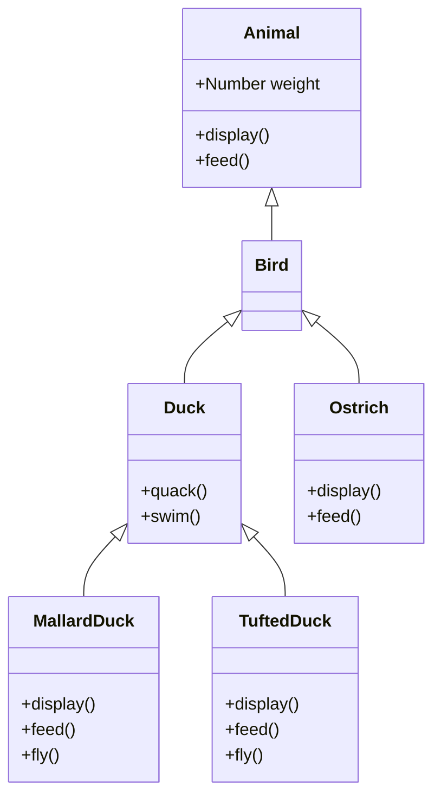

# Bird Classification System
A JavaScript-based object-oriented programming demonstration implementing a bird classification system with inheritance hierarchies.
## Class Structure
- `Animal` (base class)
  - `Bird`
    - `Duck`
      - `MallardDuck` (can fly, dabbles to feed)
      - `TuftedDuck` (can fly, dives to feed)
    - `Ostrich` (flightless, pecks to feed)

## Class Diagram

## Features
- Inheritance hierarchy demonstrating OOP principles
- Different bird behaviours:
  - Ducks
    - Mallards dabble to feed
    - Tufted ducks dive to feed
    - Both can fly
  - Ostrich
    - Pecks to feed
    - Cannot fly
- Weight tracking for all animals